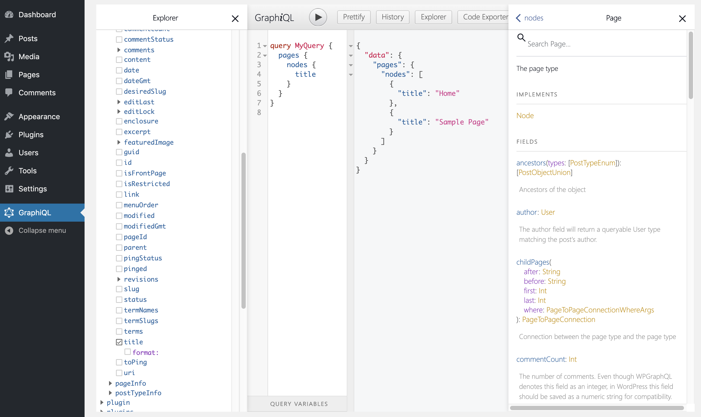
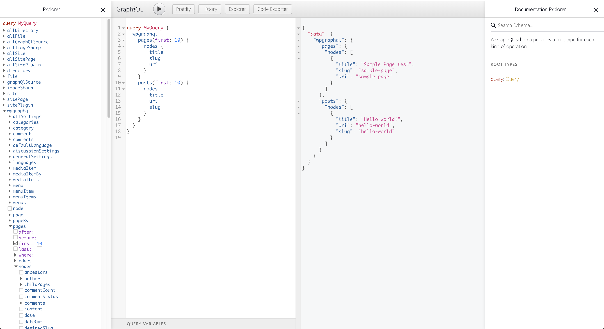

# Basic WordPress & Gatsby Setup

Hooking up our WordPress with a Gatsby generated site, will be the first steps we are talking on our journey towards a client-ready static-dynamic site.

## Table of Contents

* [Install WordPress and Plugins :floppy_disk:](#install-wordpress-and-plugins-floppydisk)
   * [Plugins](#plugins)
* [Create initial Gatsby site :computer:](#create-initial-gatsby-site-computer)
   * [Plugins](#plugins-1)
   * [Configuration](#configuration)
   * [Create Pages & Posts](#create-pages-amp-posts)
      * [Page Template](#page-template)
      * [Post Template](#post-template)
      * [Gatsby Node](#gatsby-node)
      * [Create Pages](#create-pages)
      * [Create Posts](#create-posts)
* [Final Thoughts :checkered_flag:](#final-thoughts-checkeredflag)
* [Credits :heart:](#credits)
* [What's Next :arrow_right:](#whats-next-arrowright)


## Install WordPress and Plugins :floppy_disk:

Okay, so let's start by installing WordPress. Use whatever you want for that, either local or online. I'll be using [Local by Flywheel](https://localbyflywheel.com/).

### Plugins
- [WPGraphQL](https://github.com/wp-graphql/wp-graphql) ([Documentation](https://docs.wpgraphql.com/)) - This will create your GraphQL endpoint.
- [WPGraphiQL](https://github.com/wp-graphql/wp-graphiql) - Adds a GraphiQL to your WP-Admin, which helps to see changes quickly and figure out what to query.

You can download the .zip files of these repositories and install them through WP-Admin or just **navigate to your plugin folder** and do a `git clone` like so:

```shell
git clone https://github.com/wp-graphql/wp-graphql
git clone https://github.com/wp-graphql/wp-graphiql
```

**Now make sure to activate all the plugins.**

To check out if everything works, head over to the GraphiQL explorer inside your WordPress Admin area and start playing around with it:




## Create initial Gatsby site :computer:

First of all [create a Gatsby](https://www.gatsbyjs.org/docs/quick-start/) project with:

```
gatsby new gatsby-starter-wordpress-advanced
```

After that let's install the first couple of plugins we will use for this part of the tutorial:

<h3 id="plugins-1">Plugins</h3>

- [dotenv](https://github.com/motdotla/dotenv#readme) - For loading environment variables.
- [gatsby-source-graphql](https://www.gatsbyjs.org/packages/gatsby-source-graphql/) - Helps to source the data from our WordPress GraphQL endpoint.

```shell
yarn add dotenv gatsby-source-graphql
```

### Configuration

We will use `dotenv` to have two different files for environment variables. Create `.env.development` and `.env.production` in the **root of your gatsby site's folder**. The development one will be called when `gatsby develop` is used and production is for `gatsby build`.

Add `.env.development` to `.gitignore`:

```bash
# .gitignore
.env.development
```

---

```shell
# .env.development
# This is in gitignore and should not be pushed to the repository.

WORDPRESS_URL=http://gatsby-starter-wordpress-advanced.local
```

If you use a local WordPress instance, then replace `http://gatsby-starter-wordpress-advanced.local` with the URL to your local installation. If you just use a online WordPress instance, then use the URL to that.

---

```shell
# .env.production
# Don't put any sensible data here!!!

WORDPRESS_URL=https://your-online-wordpress-instance.dev

```
Replace `https://your-online-wordpress-instance.dev` with the URL to your online WordPress instance. In Netlify you also can [use environment](https://docs.netlify.com/configure-builds/environment-variables/) variables and combine them with what is in this file.

> If you use Local By Flywheel, you can expose your local site by enabling `Live Link`. You will get an `ngrok.io` URL, which you can use for the production WORDPRESS_URL.

---

Now in your `gatsby-config.js` add this to the top before the `module.exports`:

```javascript
let activeEnv =
  process.env.GATSBY_ACTIVE_ENV || process.env.NODE_ENV || "development"

console.log(`Using environment config: '${activeEnv}'`)

require("dotenv").config({
  path: `.env.${activeEnv}`,
})

console.log(`This WordPress Endpoint is used: '${process.env.WORDPRESS_URL}'`)
```

The snippet above will help to require the right `.env` file.

Add the following to your configs `module.exports` inside `plugins:[...]`:

```javascript
    {
      resolve: "gatsby-source-graphql",
      options: {
        typeName: "WPGraphQL",
        fieldName: "wpgraphql",
        url: `${process.env.WORDPRESS_URL}/graphql`,
      },
    },

```

This will hook up your Gatsby with the WordPress instance. And expose this data under `wpgraphql`. **Note: This makes your schema different to the one that is exposed in you WordPress GraphQL endpoint. As soon as you are usinging it with Gatsby, you now have to wrap your queries with `wpgraphql{...}`**.

Try running `gatsby develop` and navigate to `http://localhost:8000/___graphql`. You will see something like this. Play around with the GraphiQL-Explorer to get familiar with the WPGraphQL schema.




### Create Pages & Posts

Now let's see, how we can create pages and posts, based on the WordPress data. **First remove the `page-2.js` in your pages folder.** Then, we start with some very simple templates.

#### Page Template

```javascript
//src/templates/pages/page.js
import React  from "react"

import Layout from "../../components/layout"
import SEO from "../../components/seo"


const Page = ({ pageContext }) => {

  const page = pageContext.page

  return (
    <Layout>
      <SEO title={page.title} />

      <h1>{page.title}</h1>
      <div dangerouslySetInnerHTML={{__html: page.content}} />

    </Layout>
  )
}

export default Page
```

#### Post Template

```javascript
import React  from "react"

import Layout from "../../components/layout"
import SEO from "../../components/seo"


const Post = ({ pageContext }) => {

  const post = pageContext.post

  return (
    <Layout>
      <SEO title={post.title} />

      <h1> {post.title} </h1>
      <div dangerouslySetInnerHTML={{__html: post.content}} />

    </Layout>
  )
}

export default Post
```

#### Gatsby Node

In your Gatsby node, add these lines:

```javascript
// gatsby-node.js

const createPages = require("./create/createPages")
const createPosts = require("./create/createPosts")

exports.createPagesStatefully = async ({ graphql, actions, reporter }, options) => {
  await createPages({ actions, graphql, reporter }, options)
  await createPosts({ actions, graphql, reporter }, options)
}
```

To separate their concerns, we split up the creation of posts and pages in different files. Create a folder called `create` in the root directory.

#### Create Pages

First we add some requires and define our GraphQL query.

```javascript
// create/createPages.js

const pageTemplate = require.resolve('../src/templates/page/index.js');

const GET_PAGES = `
    query GET_PAGES($first:Int $after:String) {
        wpgraphql {
            pages(
                first: $first
                after: $after
                # This will make sure to only get the parent nodes and no children
                where: {
                    parent: null
                }
            ) {
                pageInfo {
                    hasNextPage
                    endCursor
                }
                nodes {                
                    id
                    title
                    pageId
                    content
                    uri
                }
            }
        }
    }
`
```

You can see some variables are passed down the query. Refer to the [GraphQL Docs](https://graphql.org/learn/queries/#variables) for more information on GraphQL query variables. Also, you can see **pageInfo** with `hasNextPage` and `endCursor`. This will help for **pagination**, as we should not query for all pages/posts together, but rather do 10 at a time. **This will ensure, that we don't put too much pressure on our WordPress backend.**

```javascript
// create/createPages.js

const allPages = []
let pageNumber = 0
const itemsPerPage = 10

/**
 * This is the export which Gatbsy will use to process.
 *
 * @param { actions, graphql }
 * @returns {Promise<void>}
 */
module.exports = async ({ actions, graphql, reporter }, options) => {

  /**
   * This is the method from Gatsby that we're going
   * to use to create pages in our static site.
   */
  const { createPage } = actions
  /**
   * Fetch pages method. This accepts variables to alter
   * the query. The variable `first` controls how many items to
   * request per fetch and the `after` controls where to start in
   * the dataset.
   *
   * @param variables
   * @returns {Promise<*>}
   */
  const fetchPages = async (variables) =>
    /**
     * Fetch pages using the GET_PAGES query and the variables passed in.
     */
    await graphql(GET_PAGES, variables).then(({ data }) => {
      /**
       * Extract the data from the GraphQL query results
       */
      const {
        wpgraphql: {
          pages: {
            nodes,
            pageInfo: { hasNextPage, endCursor },
          },
        },
      } = data

      /**
       * Map over the pages for later creation
       */
      nodes
      && nodes.map((pages) => {
        allPages.push(pages)
      })

      /**
       * If there's another page, fetch more
       * so we can have all the data we need.
       */
      if (hasNextPage) {
        pageNumber++
        reporter.info(`fetch page ${pageNumber} of pages...`)
        return fetchPages({ first: itemsPerPage, after: endCursor })
      }

      /**
       * Once we're done, return all the pages
       * so we can create the necessary pages with
       * all the data on hand.
       */
      return allPages
    })

  /**
   * Kick off our `fetchPages` method which will get us all
   * the pages we need to create individual pages.
   */
  await fetchPages({ first: itemsPerPage, after: null }).then((wpPages) => {

    wpPages && wpPages.map((page) => {

      createPage({
        path: `/${page.uri}/`,
        component: pageTemplate,
        context: {
          page: page,
        },
      })

      reporter.info(`page created: ${page.uri}`)
    })

    reporter.info(`# -----> PAGES TOTAL: ${wpPages.length}`)
  })
}
```

- So here we first define our `fetchPages()` function, that will recursively keep on fetching pages (10 at a time) until there is no more to fetch. It adds them to the `allPages` array.
- Then, we map over `wpPages` and call `createPage()`. An action passed down by the  `createPagesStatefully()` function given by the Gatsby API ([See docs here](https://www.gatsbyjs.org/docs/node-apis/#createPagesStatefully)).
- In `createPage()` we set the path equal to the uri. This will be creating the slug for the individual page. The **component** gets our `pageTemplate` assigned and finally, we pass the pages data to the context.

**-> See the complete file here: [createPages.js](https://github.com/nevernull/gatsby-starter-wordpress-advanced/blob/0-overview/create/createPages.js)**

---

#### Create Posts

createPosts is basically the same with the exception of prefixing the path with `blog/`.

**-> See the complete file here: [createPosts.js](https://github.com/nevernull/gatsby-starter-wordpress-advanced/blob/0-overview/create/createPosts.js)**


## Final Thoughts :checkered_flag:

If you run `gatsby develop` now, you should be able to see your pages under http://localhost:8000/sample-page/. If you are not sure what pages got created. Just type in some random slug like http://localhost:8000/asdf/ and you will get an overview of all the pages there are.

This will give you the basic setup we need for the upcoming parts of this tutorial.

Find the code here:


## Credits :heart:

This part is highly inspired by [staticfuse's (gatsby-theme-publisher)](https://github.com/staticfuse/staticfuse/tree/master/packages/gatsby-theme-publisher). You should check it out!

## What's Next :arrow_right:

Next we'll build our navigation based on a WordPress menu.

Coming up soon: **Part 2** - Setup Menu Navigation
