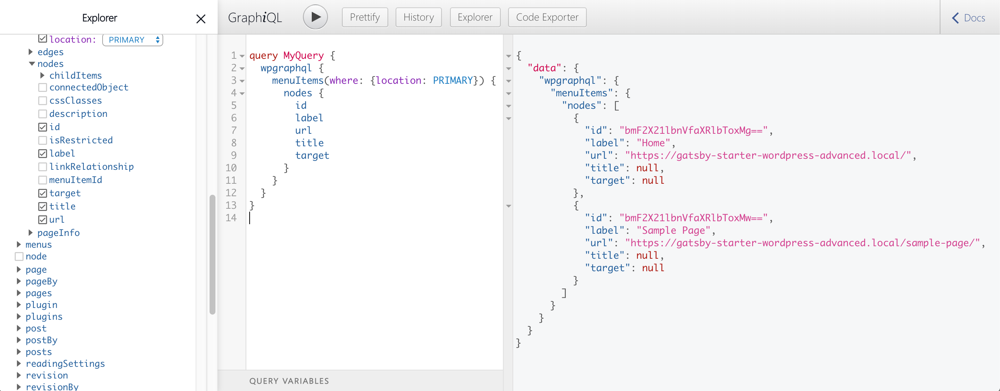

# Setup Menu Navigation

In this part we create some navigation based on a WordPress Menu, to reference our pages and posts, that we generated in the [previous part]().

## Create WordPress Menu

Let's get started by creating content in WordPress.

1. Before creating a menu, make sure you have some **example pages** like so:

<br/><br/>

2. **Create the Main Menu** with the pages you want to add. Assign the page to the primary location.

<br/><br/>

3. Play around in the GraphiQL explorer:


    - If you use the WordPress **Twenty Twenty Theme** and set your menu to the primary position, you have to set the where->location to `PRIMARY`. Play around with the explorer to see what options you have in the location drop-down.

    - As you can see, the URL we get is not relative and there is now slug. We could extend the WPGraphQL schema to add another field for that. We will do this later. **For now we just gonna strip the domain from the URL in the frontend (quick and dirty).**


## Create components in Gatsby

Now, let's add some code to render our menu in Gatsby.

1. Creating a **utils function** to create relative URLs:

```javascript
// src/utils/index.js

/**
 * Parses a menu item object and returns Gatsby-field URI.
 *
 * @param {object} menuItem a single menu item
 * @param wordPressUrl
 * @param blogURI
 */
export const CreateLocalLink = (menuItem, wordPressUrl, blogURI='blog/') => {
  const { url, connectedObject } = menuItem;

  if (url === '#') {
    return null;
  }
  /**
   * Always want to pull of our API URL.
   */
  let newUri = url.replace(wordPressUrl, '');

  /**
   * If it's a blog link, respect the users blogURI setting.
   */
  if (connectedObject && connectedObject.__typename === 'WPGraphQL_Post') {
    newUri = blogURI + newUri;
  }

  return newUri;
};
```
---

2. Creating **MenuItem component**, that uses our util function:

```javascript
// src/components/MenuItem.js

import React from "react"
import { CreateLocalLink } from "../utils"
import { Link } from "gatsby"

const MenuItem = ({ menuItem, wordPressUrl }) => {
  return (
    <Link style={{marginRight: '20px' }} to={CreateLocalLink(menuItem, wordPressUrl)}>{menuItem.label}</Link>
  )
}

export default MenuItem
```
---

3. Creating **Menu component**, that uses our MenuItem component:

```javascript
// src/components/Menu.js

import React from "react"
import { StaticQuery, graphql } from "gatsby"

import MenuItem from "./MenuItem"

/**
 * Get all primary menuItems and the sites url.
 */
const MENU_QUERY = graphql`
    query GETMAINMENU {
        wpgraphql {
            menuItems(where: {location: PRIMARY}) {
                nodes {
                    id
                    label
                    url
                    title
                    target
                }
            }
            generalSettings {
                url
            }
        }
    }

`

const Menu = () => {
  return (
    <StaticQuery
      query={MENU_QUERY}
      render={(data) => {
        if (data.wpgraphql.menuItems) {
          const menuItems = data.wpgraphql.menuItems.nodes
          const wordPressUrl = data.wpgraphql.generalSettings.url

          return (
            <div style={{marginBottom: '20px'}}>
              {
                menuItems &&
                menuItems.map((menuItem) => (
                  <MenuItem key={menuItem.id} menuItem={menuItem} wordPressUrl={wordPressUrl}/>
                ))
              }
            </div>
          )
        }
        return null
      }}
    />
  )
}

export default Menu
```

---


4. And finally **adding the Menu** to `layout.js`:


```javascript
// src/components/layout.js

/**
 * Layout component that queries for data
 * with Gatsby's useStaticQuery component
 *
 * See: https://www.gatsbyjs.org/docs/use-static-query/
 */

import React from "react"
import PropTypes from "prop-types"
import { useStaticQuery, graphql } from "gatsby"

import Header from "./header"
import "./layout.css"
import Menu from "./Menu"

const Layout = ({ children }) => {
  const data = useStaticQuery(graphql`
    query SiteTitleQuery {
      site {
        siteMetadata {
          title
        }
      }
    }
  `)

  return (
    <>
      <Header siteTitle={data.site.siteMetadata.title} />
      <div
        style={{
          margin: `0 auto`,
          maxWidth: 960,
          padding: `0px 1.0875rem 1.45rem`,
          paddingTop: 0,
        }}
      >
        <Menu />
        <main>{children}</main>
        <footer>
          © {new Date().getFullYear()}, Built with
          {` `}
          <a href="https://www.gatsbyjs.org">Gatsby</a>
        </footer>
      </div>
    </>
  )
}

Layout.propTypes = {
  children: PropTypes.node.isRequired,
}

export default Layout
```

## Final Thoughts :checkered_flag:

If you run `gatsby develop` now, ...

Find the code here:


## What's Next :arrow_right:

Next we'll build our navigation based on a WordPress menu.

Coming up soon: **Part 3** - Deployment
