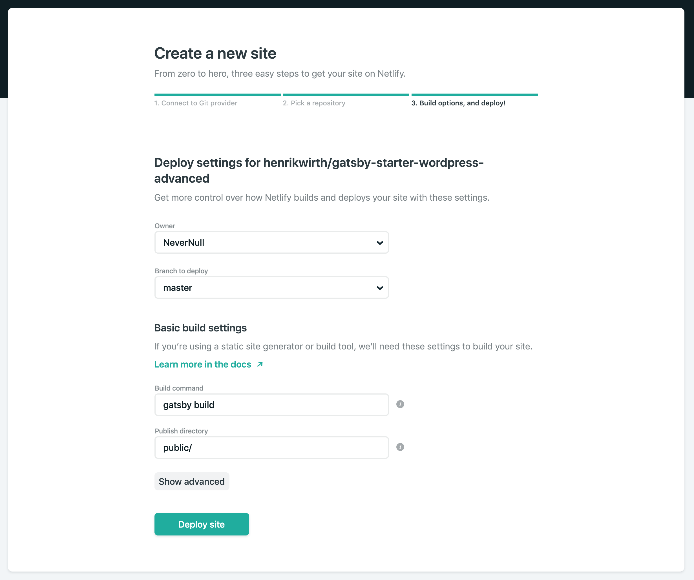
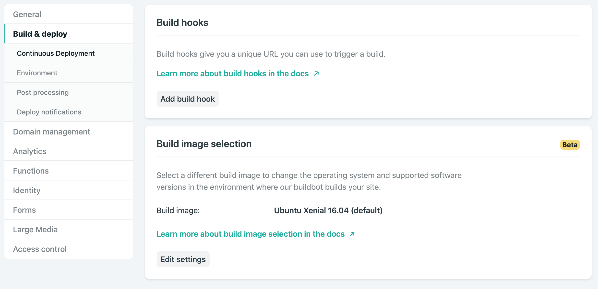
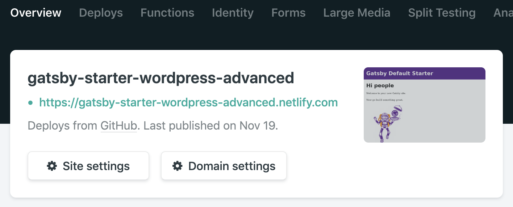
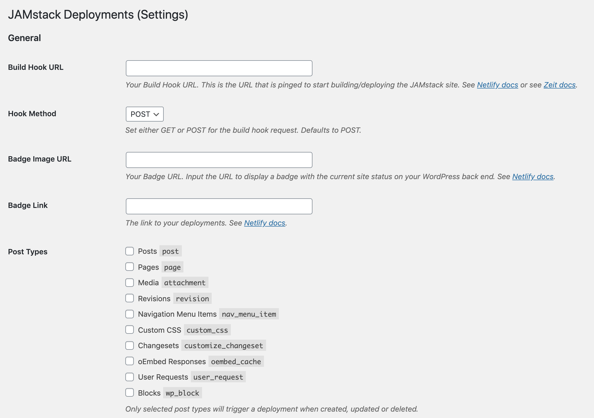

# Deployment

Finally we have the basics and it's time to see what we've done in production. I'll quickly go through some ways to deploy your site. I will mainly focus on Netlify for this, but also give an example for GitLab pages.

## Netlify Setup

1. First of all, make sure you have a repository, with all your work so far pushed to master. Preferably on GitHub. Now get yourself a Netlify account and connect it with your GitHub repository. I won't go into details for that. There is plenty of documentation out there.


2. If you create a project from your Gatsby repository, Netlify should recognize, that it is a Gatsby project and you should see something like this:


3. Now go to the **Build & Deploy** settings and **add a build hook**.


4. **Copy the build hook URL for later use**.

5. By the time you got your build hook, Netlify should already be finished building your site. **Checkout your Netlify domain**.



## WordPress Plugin

We will setup a WordPress plugin, to be able to make use of the build hook. With this, we can decide when to trigger a build. For example, you can build only when pressing the build button, or after every post/page update. There is plenty more options.

- [WP JAMstack Deployments](https://github.com/crgeary/wp-jamstack-deployments) - To add your Netlify (or other webhook) build and to show a build status badge.
  - Also available in the WordPress Plugin registry: [here](https://wordpress.org/plugins/wp-jamstack-deployments/)

While I would suggest this plugin. There is also other plugins out there.

You can download the .zip files of these repositories and install them through WP-Admin or just **navigate to your plugin folder** and do a `git clone` like so:

```
git clone https://github.com/crgeary/wp-jamstack-deployments
```

1. Activate the plugin.

2. Now **go to Settings->Deployments** and fill in form:

  - **Build Hook URL**: The Netlify build hook you created before.
  - **Badge Image URL**: You can find the badge URL in the **General->Status badges** settings of Netlify. It consists of 2 URLs. The first one is the one you need for the status badge.
  - **Badge Link**: When you click on the Netlify badge, the link you set here will open. You can either set it to your Netlify site domain, or you use the second URL from the status badge, which will link to your Netlify deploy status page.
